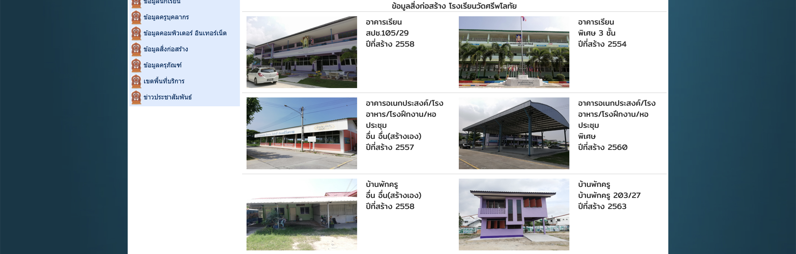

# Open School Data

```sh
docker build -t opensd .
docker run -it --rm \
  --name openschooldata \
  -v $(pwd)/data:/usr/src/app/out
  opensd
```

## โครงสร้าง

```
.
└── <year-month>
    ├── html
    │   ├── province
    │   └── school
    │       ├── building
    │       │   └── images
    │       ├── computer_internet
    │       ├── durable_goods
    │       ├── general
    │       │   └── image
    │       ├── staff
    │       └── student
    └── school_data
        └── school
            ├── <school_id>
            ├── <school_id>
            └── <school_id>
```

หน้า HTML ท่ีโหลดมาอยู่ที่

```
<year-month>/html
├── province : เก็บหน้าที่มีรายการโรงเรียนทั้งหมดในจังหวัด
│   ├── <province_id>.html
│   ├── <province_id>.html
│   ├── <province_id>.html
│   └── index.html
└── school : เก็บหน้าที่มีข้อมูลของโรงเรียน
    ├── building : สิ่งก่อสร้าง
    │   ├── <school_id>.html
    │   ├── <school_id>_building_list.html
    │   ├── <school_id>.html
    │   ├── <school_id>_building_list.html
    │   └── images
    │       ├── <school_id>_<running_id>.jpg
    │       ├── <school_id>_<running_id>.jpg
    │       └── <school_id>_<running_id>.jpg
    ├── computer_internet : คอมพิวเตอร์ อินเทอร์เน็ต
    │   ├── <school_id>.html
    │   └── <school_id>.html
    ├── durable_goods : ครุภัณฑ์
    │   ├── <school_id>.html
    │   └── <school_id>.html
    ├── general : พื้นฐานโรงเรียน
    │   ├── <school_id>.html
    │   ├── <school_id>.html
    │   └── image
    │       ├── <school_id>.jpg
    │       ├── 1020080034-20150531-102503.jpg
    │       ├── <school_id>-20210404-112104.jpg
    │       └── <school_id>.jpg
    ├── staff : ครูบุคลากร
    │   ├── <school_id>.html
    │   └── <school_id>.html
    └── student : นักเรียน
        ├── <school_id>.html
        └── <school_id>.html

```

บนหัวของ HTML จะมี comment ไว้ใส่ metadata อย่าง url ที่ดึงมา และวันที่ดึงมา

```html
<!--
	url: https://bobec.bopp-obec.info/web_school_view.php?per_code=080005
	scrape_date: 2022-09-16
-->

	
<!DOCTYPE html>
<html lang="en">
	<head>
    ...
```
# ลักษณะข้อมูล

## ข้อมูลพื้นฐาน
- ดึงข้อมูลมาจาก[หน้านี้](https://data.bopp-obec.info/emis/schooldata-view.php?School_ID=1020080005&Area_CODE2=2001) 
- ข้อมูลที่ได้มาจะอยู่ใน `<year-month>/school_data/general.json` ใช้ key เป็น school id 10 หลัก

ข้อมูลบนหน้าเว็บ [data.bopp-obec.info/emis/schooldata-view.php?School_ID=1020080005&Area_CODE2=2001](https://data.bopp-obec.info/emis/schooldata-view.php?School_ID=1020080005&Area_CODE2=2001)

```
รหัสโรงเรียน 10 หลัก : 1020080005
   รหัส Smis 8 หลัก : 20010029
   รหัส Obec 6 หลัก : 080005
  ชื่อสถานศึกษา(ไทย) : วัดศรีพโลทัย
ชื่อสถานศึกษา(อังกฤษ) : WATSRIPALOTHAI
              ที่อยู่ : หมู่ที่   1   บ้านหนองไม้แดง
             ตำบล : หนองไม้แดง
            อำเภอ : เมืองชลบุรี
```

รูปข้อมูลที่ดึงมา
```json
{
  "1020080005": [
    {
      "key": "รหัสโรงเรียน 10 หลัก",
      "value": "1020080005"
    },
    {
      "key": "รหัส Smis 8 หลัก",
      "value": "20010029"
    },
    {
      "key": "รหัส Obec 6 หลัก",
      "value": "080005"
    },
    {
      "key": "ชื่อสถานศึกษา(ไทย)",
      "value": "วัดศรีพโลทัย"
    },
    {
      "key": "ชื่อสถานศึกษา(อังกฤษ)",
      "value": "WATSRIPALOTHAI"
    },
    {
      "key": "ที่อยู่",
      "value": "หมู่ที่ 1 บ้านหนองไม้แดง"
    },
    {
      "key": "ตำบล",
      "value": "หนองไม้แดง"
    },
    {
      "key": "อำเภอ",
      "value": "เมืองชลบุรี"
    },
    {
      "key": "logo_image_path",
      "value": "2022-09/html/school/general/image/1020080005.jpg"
    },
    {
      "key": "principal_image_path",
      "value": "2022-09/html/school/general/image/1020080034-20150531-102503.jpg"
    },
    {
      "key": "latlng",
      "value": [
        13.415917589703469,
        100.99043077777105
      ]
    }
  ],
}
```


## ข้อมูลนักเรียน
- ได้มาจาก[หน้านี้](https://data.bopp-obec.info/emis/schooldata-view_student.php?School_ID=1020080005&Area_CODE2=2001)
- ข้อมูลอยู่[ที่นี่](2022-09/school_data/student.csv) แต่ละแถวจะมี school id 10 หลักเพื่อบอก

## ข้อมูลครูบุคลากร
- ได้มาจาก[หน้านี้](https://data.bopp-obec.info/emis/schooldata-view_techer.php?School_ID=1020080005&Area_CODE=2001)
- ข้อมูลอยู่[ที่นี่](2022-09/school_data/staff.csv) แต่ละแถวจะมี school id 10 หลักเพื่อบอก

## ข้อมูลคอมพิวเตอร์ อินเทอร์เน็ต

- ได้มาจาก[หน้านี้](https://data.bopp-obec.info/emis/schooldata-view_com-internet.php?School_ID=1020080005&Area_CODE=2001)
- จะเก็บข้อมูลเป็น 2 ส่วนคือ[คอมพิวเตอร๋](2022-09/school_data/computer.csv)และ[อินเทอร์เน็ต](2022-09/school_data/internet.csv)

ตัวอย่างข้อมูลจากบนเว็บ

```
 จำนวนคอมพิวเตอร์เพื่อการเรียนการสอน
 งบประมาณ สพฐ.	30 เครื่อง
จัดหาเอง/บริจาค:	10 เครื่อง
           รวม	40 เครื่อง
      ใช้งานได้:	20 เครื่อง
    ใช้งานไม่ได้:	20 เครื่อง
จำนวนคอมพิวเตอร์เพื่อการบริหารจัดการ
  งบประมาณ สพฐ.	2 เครื่อง
จัดหาเอง/บริจาค:	1 เครื่อง
            รวม	3 เครื่อง
      ใช้งานได้:	3 เครื่อง
     ใช้งานไม่ได้:	0 เครื่อง
จำนวนคอมพิวเตอรทั้งหมด
    คอมพิวเตอร์:	43 เครื่อง
      ใช้งานได้:	23 เครื่อง
    ใช้งานไม่ได้:	20 เครื่อง
```
ข้อมูลที่เก็บจะอยู่ในรูป

|0|1|2|
|---|---|---|
|จำนวนคอมพิวเตอร์เพื่อการเรียนการสอน|งบประมาณ สพฐ.|30 เครื่อง|
|จำนวนคอมพิวเตอร์เพื่อการเรียนการสอน|จัดหาเอง/บริจาค:|10 เครื่อง|
|จำนวนคอมพิวเตอร์เพื่อการเรียนการสอน|รวม|40 เครื่อง|
|จำนวนคอมพิวเตอร์เพื่อการเรียนการสอน|ใช้งานได้:|20 เครื่อง|
|จำนวนคอมพิวเตอร์เพื่อการเรียนการสอน|ใช้งานไม่ได้:|20 เครื่อง|
|จำนวนคอมพิวเตอร์เพื่อการบริหารจัดการ|งบประมาณ สพฐ.|2 เครื่อง|
|จำนวนคอมพิวเตอร์เพื่อการบริหารจัดการ|จัดหาเอง/บริจาค:|1 เครื่อง|
|จำนวนคอมพิวเตอร์เพื่อการบริหารจัดการ|รวม|3 เครื่อง|
|จำนวนคอมพิวเตอร์เพื่อการบริหารจัดการ|ใช้งานได้:|3 เครื่อง|
|จำนวนคอมพิวเตอร์เพื่อการบริหารจัดการ|ใช้งานไม่ได้:|0 เครื่อง|
|จำนวนคอมพิวเตอรทั้งหมด|คอมพิวเตอร์:|43 เครื่อง|
|จำนวนคอมพิวเตอรทั้งหมด|ใช้งานได้:|23 เครื่อง|
|จำนวนคอมพิวเตอรทั้งหมด|ใช้งานไม่ได้:|20 เครื่อง|
## ข้อมูลสิ่งก่อสร้าง
- ได้มาจาก[หน้านี้](https://data.bopp-obec.info/emis/schooldata-view_bobec.php?School_ID=1020080005&Area_CODE=2001)
- เก็บอยู่[ที่นี่](2022-09/school_data/building.json)

ตัวอย่างจากหน้านี้



จะได้ข้อมูลที่จัดเก็บดังนี้
```json
{
  "1020080005": [
    {
      "image_url": "https://bobec.bopp-obec.info/b01/800054010625580120191011104209844453542.jpg",
      "image_description": [
        "อาคารเรียน",
        "สปช.105/29",
        "ปีที่สร้าง 2558"
      ],
      "path": "2022-09/html/school/building/images/1020080005_00.jpg"
    },
    {
      "image_url": "https://bobec.bopp-obec.info/b01/200100295014125542010120191011121748430521253.jpg",
      "image_description": [
        "อาคารเรียน",
        "พิเศษ 3 ชั้น",
        "ปีที่สร้าง 2554"
      ],
      "path": "2022-09/html/school/building/images/1020080005_01.jpg"
    },
    {
      "image_url": "https://bobec.bopp-obec.info/b02/800052021125570220191011120853335021609.jpg",
      "image_description": [
        "อาคารอเนกประสงค์/โรงอาหาร/โรงฝึกงาน/หอประชุม",
        "อื่น อื่น(สร้างเอง)",
        "ปีที่สร้าง 2557"
      ],
      "path": "2022-09/html/school/building/images/1020080005_02.jpg"
    },
    {
      "image_url": "https://bobec.bopp-obec.info/b02/200100293021825602010220191011122231328862316.jpg",
      "image_description": [
        "อาคารอเนกประสงค์/โรงอาหาร/โรงฝึกงาน/หอประชุม",
        "พิเศษ",
        "ปีที่สร้าง 2560"
      ],
      "path": "2022-09/html/school/building/images/1020080005_03.jpg"
    },
    ...
  ]
}
```
## ข้อมูลครุภัณฑ์
- ได้มาจาก[หน้านี้](https://data.bopp-obec.info/emis/schooldata-view_mobec.php?School_ID=1011570150&Area_CODE=101706)
- ข้อมูลอยู่[ที่นี่](2022-09/school_data/durable_goods.csv) แต่ละแถวจะมี school id 10 หลักเพื่อบอก

